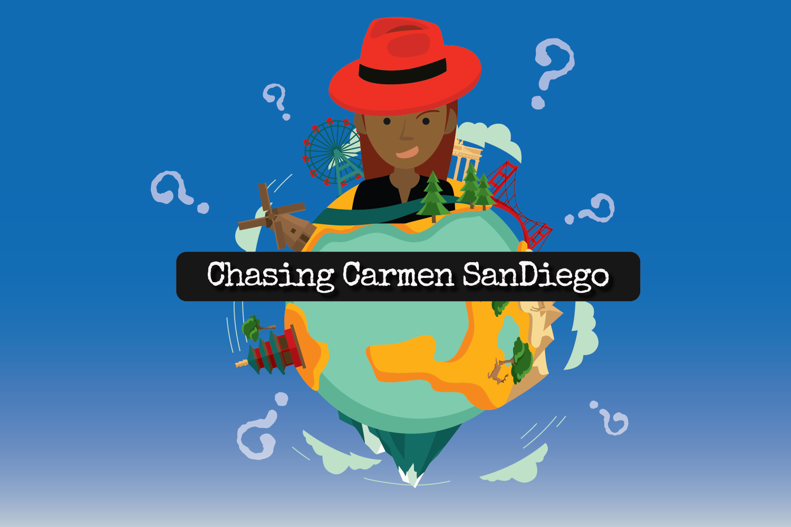
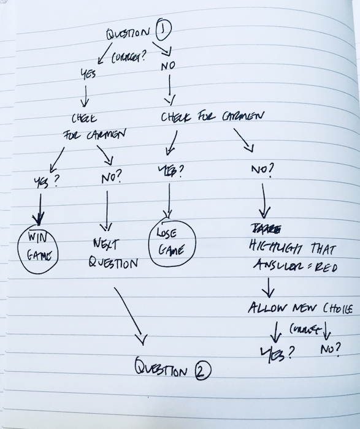
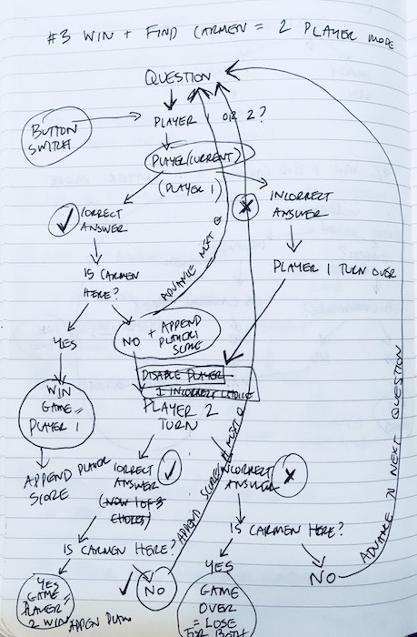
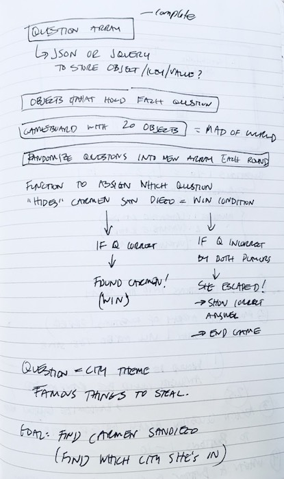

# Chasing Carmen SanDiego

[**Live Game Demo **](https://hannan-emily.github.io/ChasingCarmenSanDiego) 

*Chasing Carmen SanDeigo* is a delightful new trivia game that pits you against that international thief, Carmen SanDiego.

Obscure questions? Yep! Totally frustrating if you don't know why Naica, Mexico is famous? You betcha.

Interrogate enough witnesses in this airport setting, and you're bound to catch Ms. SanDiego in the end.

This is two-player game so no one is left out of the fun.

## Development

### Technologies
jQuery
HTML5 Canvas
Materialize

### Premise
This game needed to fit these requirements:

1. Display a game in the browser
2. Switch turns between two players, or switch turns between a player and the computer (AI)*
3. Design logic for winning & visually display which player won.
4. Include separate HTML / CSS / JavaScript files.
5. Stick with KISS (Keep It Simple Stupid) and DRY (Don't Repeat Yourself) principles
6. Use Javascript or jQuery for DOM manipulation
7. Deploy your game online, where the rest of the world can access it**
8. Use semantic markup for HTML and CSS (adhere to best practices)

#### Development
1. Game Theme: Hunt for a main character (Carmen SanDiego) as a two level trivia game.
  * Array of questions centered around valuable treasures around the world
  * Player must get question correct before they find if Carmen is "hiding" in that city.
2. Array of questions/answers
  * Build a jquery array of objects
  * Use this array in order to randomize answers and randomize questions easily, and store for future functions.
  * Set up 3 incorrect answers, 1 correct answer
3. Question win, game win
  * player must pass two conditions to win game
  * answer question correctly, win "question level"
  * each question has been cycled through the add carmen class function. 1 of 12 questions is randomly assigned the "carmen" class. if player correctly answers that question, they find the "carmen" class, and win the game.
4. Game lose
  * if either player incorrectly answers the "carmen" class question, they lose the whole game.
5. 2 player mode & restrictions
  * 12 possible questions to answer.
  * in order to end game within the 12 question limit, each player is given 3 wrong answer chances (called tickets in the game). if either player gets 3 answers wrong, both lose the game.
  * no more than 6 turns can be used as wrong answers, before the game ends.
6. Graphics
  * as the game is set in airport, questioning witnesses, I designed custom vector graphics for the game.

Notes from development process

### Challenges
1. The reset game function took sometime to set up to work smoothly. The on click listeners for the materialize cards and modals I used were not working, due to some css conflicts?
2. I set up the navigation bar "start game" button to overcome these buttons not working properly.

### Future Revisions

In the next possible versions, I'd like to set up the questions to randomize.

I'd also like to add in my end game title graphics - one for winning, and one for losing.
